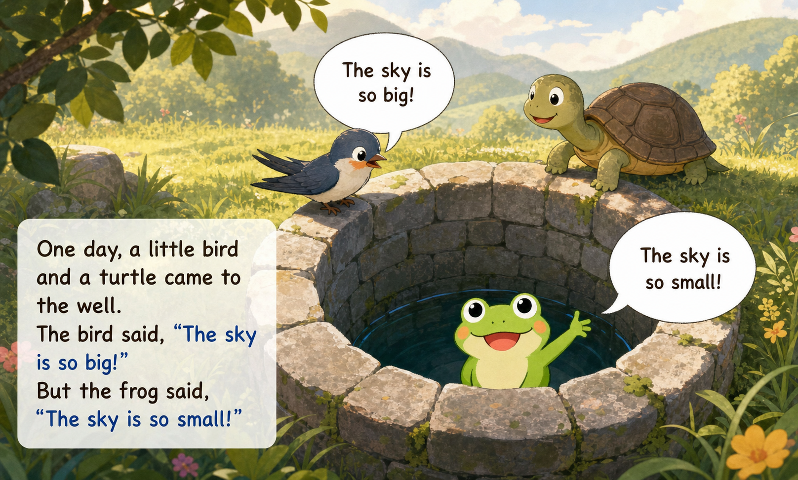
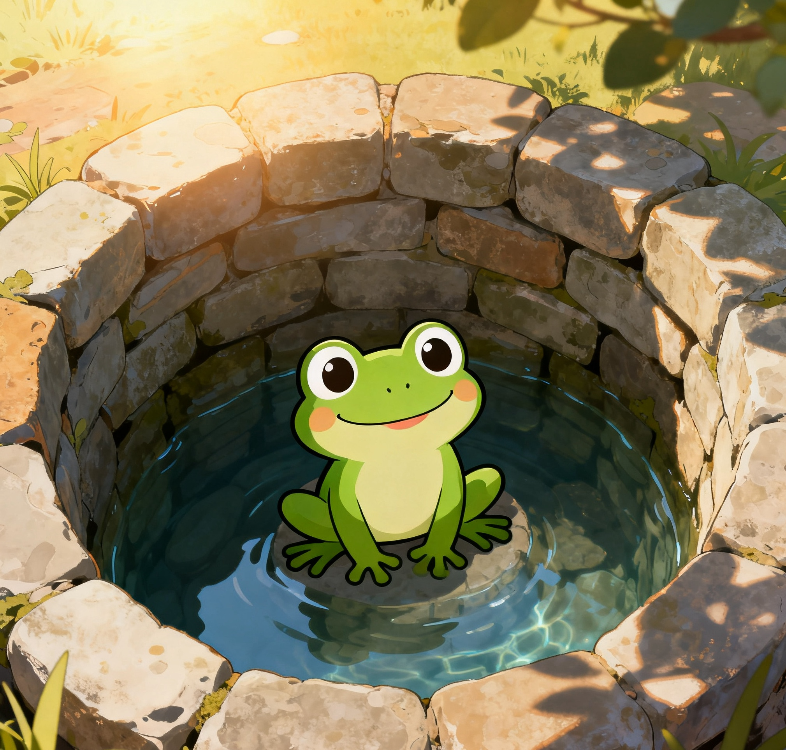
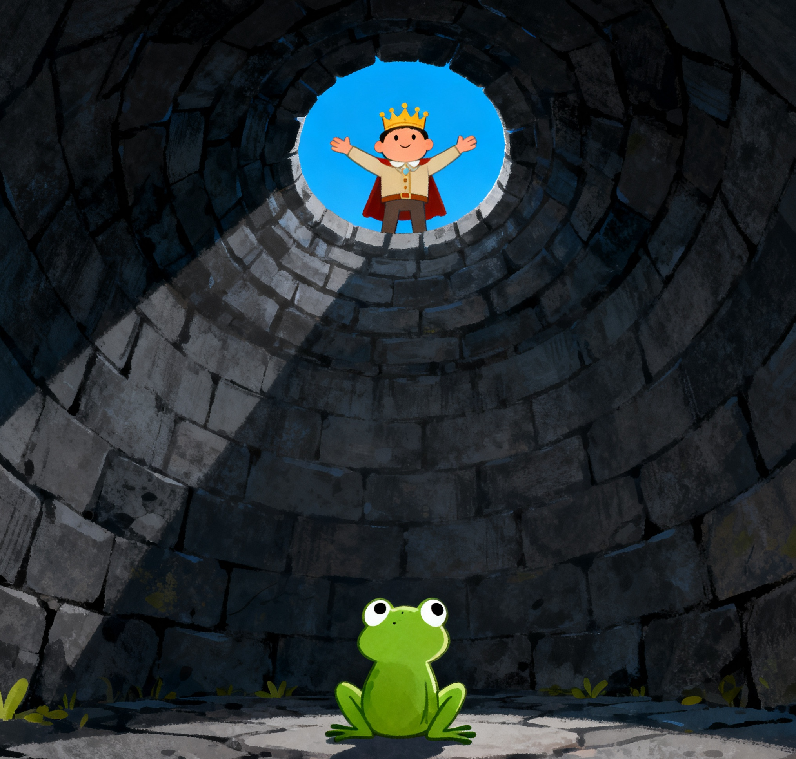
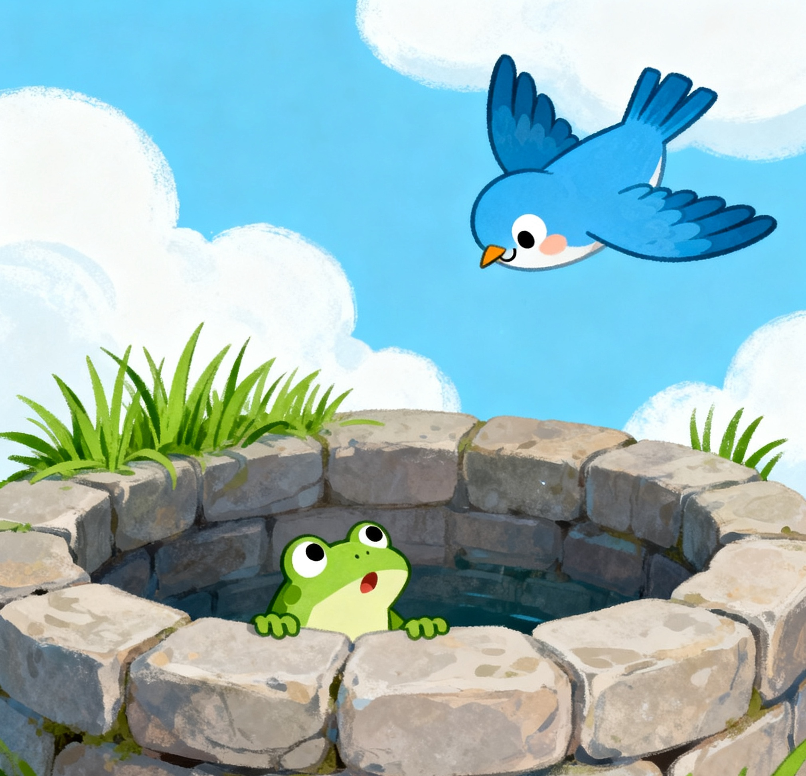
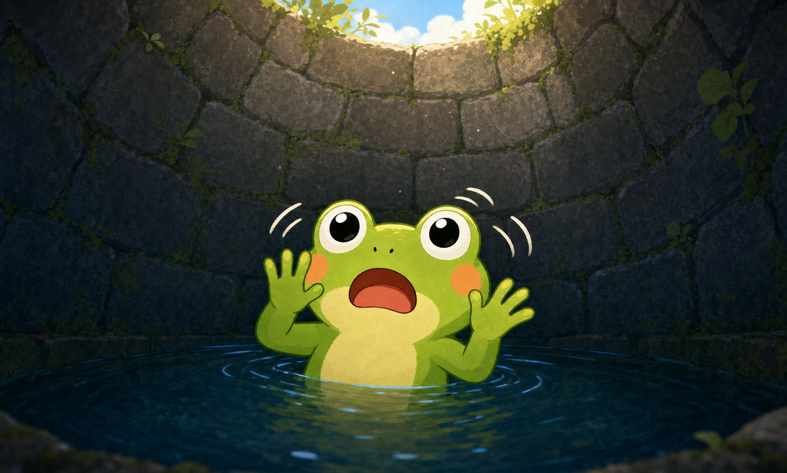
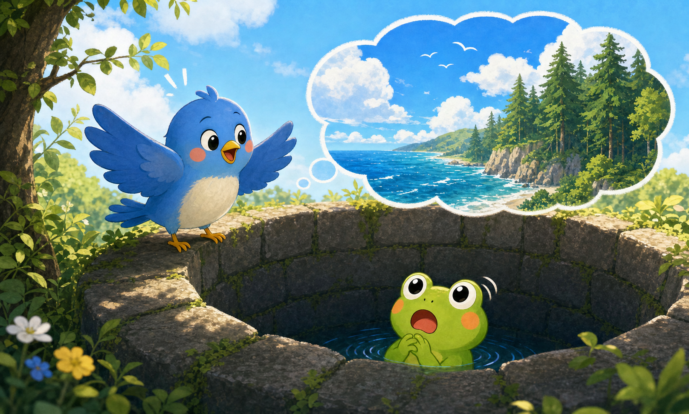
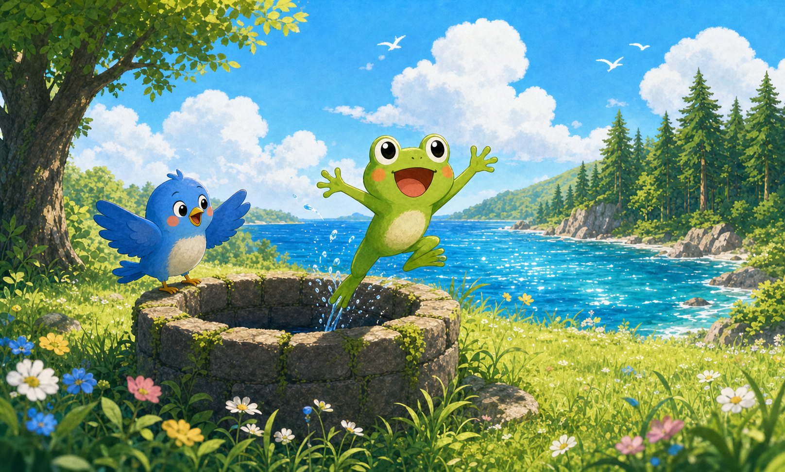
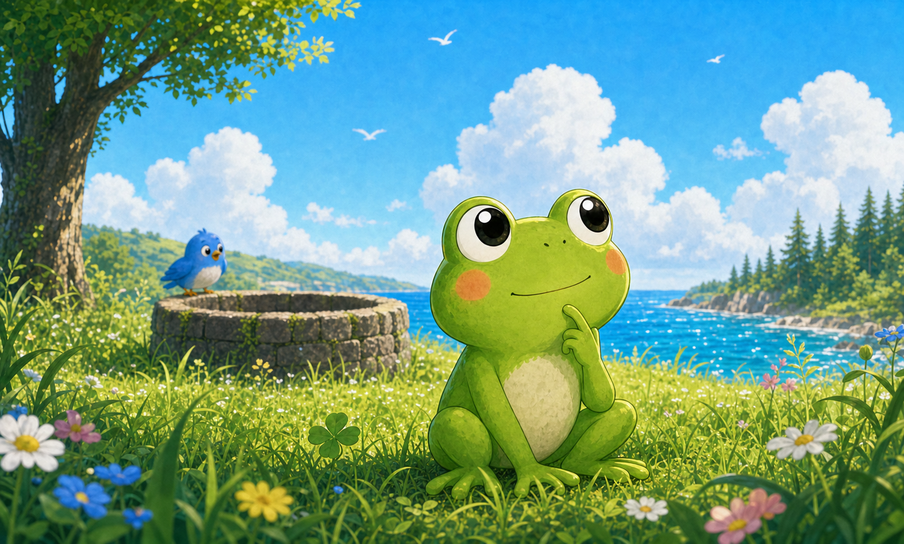
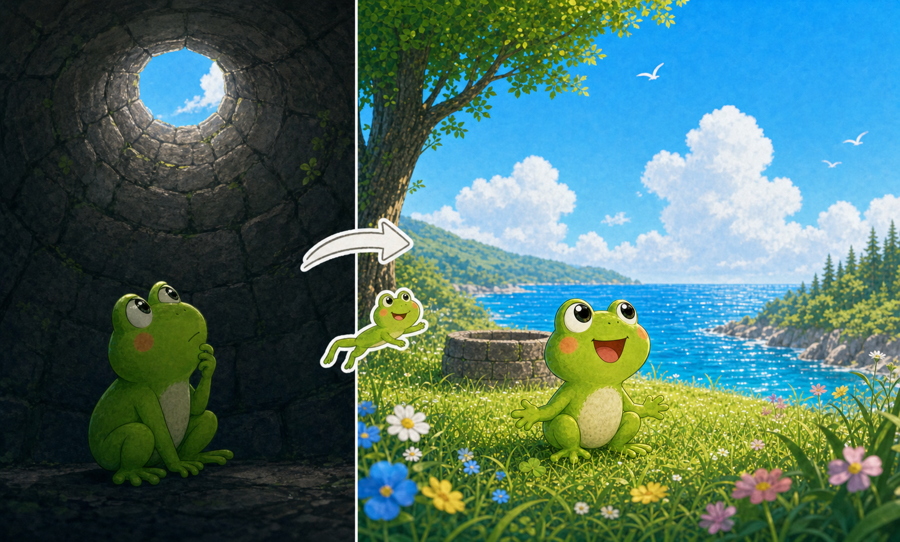
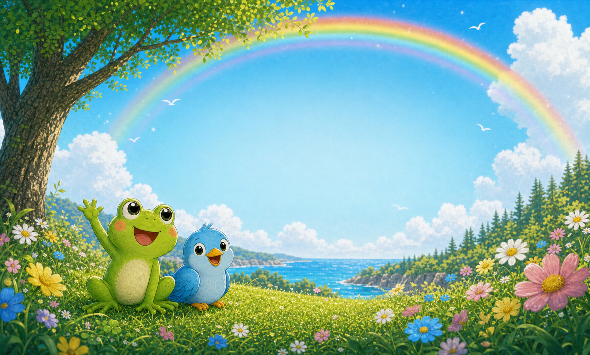

---

## Once upon a time ...
There was a little **frog**.

He lived in a **well**.

He was very **happy**.
---

## The Frog's World
The frog looked up.

He saw a **small** blue sky.

He said: "The **world** is small!

I am the **king** of the world!"
---

## A Bird Comes
One day, a **bird** flew to the well.

The bird said:

"Hello, little frog!

Why don't you come out and **see** the **big** world?"
---

## The Frog is Surprised
The frog said:

"No, no! The world is **small**!

I can see it **all** from here!"
---

## The Bird Tells Him
The bird said:

"Come and see!

There are **big** seas, **tall** trees,

and **blue** skies far away.

The world is very, very **big**!"
---

## The Frog Learns
The frog **jumped** out of the well.

He looked around.

He saw the **big** blue sky.

He saw **tall** green trees.

He saw a **beautiful** lake.
---

## The Frog Understands
The frog said:

"**Oh!** The world is so **big**!

I only saw a **small** part of it.

I was wrong."
---

## The Lesson
**井底之蛙**

A frog in a well cannot see the **big** ocean.

A small **view** gives a small **mind**.
---

# **Thank You!**
